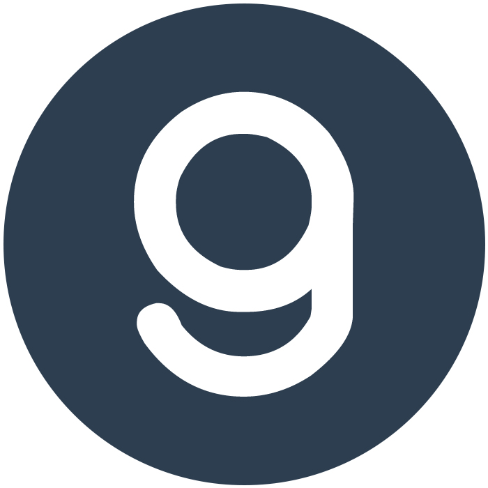

# 🚀 Landing Page Dicoding

Proyek ini bertujuan untuk membangun **landing page** interaktif menggunakan **HTML** dan **CSS**, serta mengimplementasikan berbagai teknik dasar web development.

## 📌 Alur Pengerjaan

### 1️⃣ Membuat dan Membuka Proyek Baru
- Buat folder proyek dan buka menggunakan **Visual Studio Code** atau editor pilihan.
- Struktur awal proyek:
  ```
  Landing-Page-Dicoding/
  │── index.html
  │── css/
  │   ├── app.css
  │── img/
  │   ├── dicoding-header-logo.png
  │   ├── circle-g.jpg
  ```

### 2️⃣ Membuat Struktur Proyek dan Aset-aset yang Dibutuhkan
- Siapkan folder `css/` untuk menyimpan file **style**.
- Siapkan folder `img/` untuk gambar dan ikon.

### 3️⃣ Membuat Struktur Navigation Bar
Gunakan elemen `<header>` dan `<nav>` untuk membangun bar navigasi:
```html
<header class="navbar-container">
  <div class="logo">
    
  </div>
  <nav class="nav-list">
    <ul>
      <li><a href="#">Beranda</a></li>
      <li><a href="#">Menu</a></li>
      <li><a href="#">Apa Yang Baru</a></li>
      <li><a href="#">Kontak</a></li>
    </ul>
  </nav>
</header>
```

### 4️⃣ Memasang Font Quicksand dari Google Fonts
Tambahkan link berikut di bagian `<head>` pada `index.html`:
```html
<link href="https://fonts.googleapis.com/css2?family=Quicksand:wght@300..700&display=swap" rel="stylesheet">
```
Lalu terapkan di `style.css`:
```css
body {
  font-family: "Quicksand", sans-serif;
}
```

### 5️⃣ Menerapkan Styling Dasar Proyek dan Bar Navigasi
Tambahkan aturan dasar dalam `style.css` untuk menyusun navigasi agar lebih rapi:
```css
header.navbar-container {
  width: 100%;
  max-width: 1200px;
  padding-block: 1rem;
  margin-inline: auto;
  display: flex;
  justify-content: space-around;
  align-items: center;
}

header.navbar-container .nav-list ul {
  display: flex;
  gap: 2rem;
}
```

### 6️⃣ Menambahkan Struktur Konten Utama pada Dokumen HTML
Tambahkan konten utama dengan judul dan deskripsi:
```html
<main>
  <div class="content">
    <div class="content-description">
      <h1 class="title">Dicoding Indonesia</h1>
      <p>
        Kami yakin pendidikan teknologi adalah fondasi bagi setiap bangsa agar menjadi yang terdepan dalam dunia digital.
      </p>
      <button>Lebih Lanjut</button>
    </div>
    <div class="content-image">
      
    </div>
  </div>
</main>
```

### 7️⃣ Menampilkan Ikon Sosial Media dengan Font Awesome CDN
Gunakan ikon sosial media dalam **Font Awesome**:
```html
<link rel="stylesheet" href="https://cdnjs.cloudflare.com/ajax/libs/font-awesome/5.15.4/css/all.min.css">
```
```html
<div class="social-media">
  <ul>
    <li><a href="#"><i class="fab fa-youtube"></i></a></li>
    <li><a href="#"><i class="fab fa-linkedin-in"></i></a></li>
    <li><a href="#"><i class="fab fa-twitter"></i></a></li>
    <li><a href="#"><i class="fab fa-facebook"></i></a></li>
  </ul>
</div>
```

### 8️⃣ Melakukan Styling pada Konten Utama Halaman
Tambahkan CSS agar tampilan lebih menarik:
```css
main .content {
  display: flex;
  align-items: center;
}

main .content .content-description .title {
  font-size: 2.5rem;
}

main .content .content-description button {
  padding: 0.8rem 2.5rem;
  background-color: #2d3e50;
  color: white;
  font-size: 1rem;
  border-radius: 999px;
}
```

### 9️⃣ Menjalankan Dokumen HTML pada Browser
- Buka file `index.html` langsung di browser.
- Gunakan ekstensi **Live Server** di **VS Code** untuk melihat perubahan secara langsung.

## 🚀 Teknologi yang Digunakan
- **HTML5** → Struktur halaman web.
- **CSS3** → Styling dan layout.
- **Google Fonts** → Font Quicksand.
- **Font Awesome** → Ikon sosial media.
- **Flexbox & Grid** → Tata letak yang responsif.

## 🎯 Tujuan Proyek
Latihan ini bertujuan untuk memahami konsep dasar dalam membangun **landing page** yang modern dan responsif.

---
